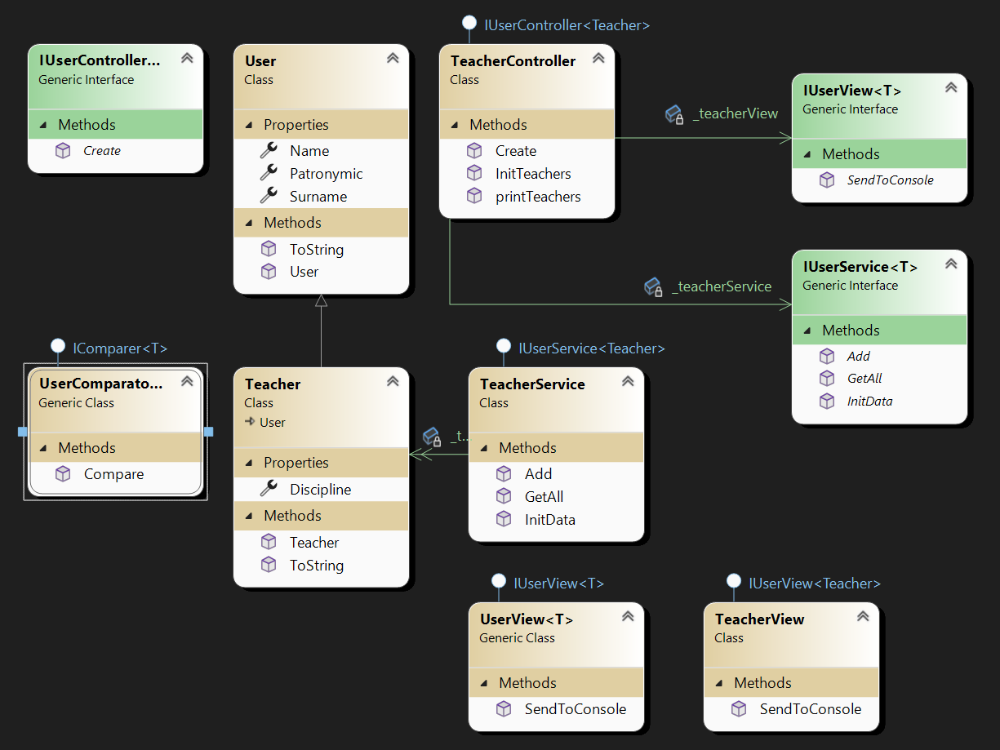

Урок 3. Некоторые стандартные интерфейсы Java и примеры их использования

>— Создать класс УчительСервис и реализовать аналогично проделанному на семинаре;
— Создать класс УчительВью и реализовать аналогично проделанному на семинаре;
— Создать класс УчительКонтроллер и реализовать возможность создания, редактирования конкретного учителя и отображения списка учителей, имеющихся в системе.

Работа программы

